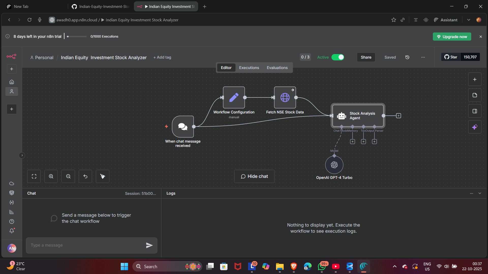
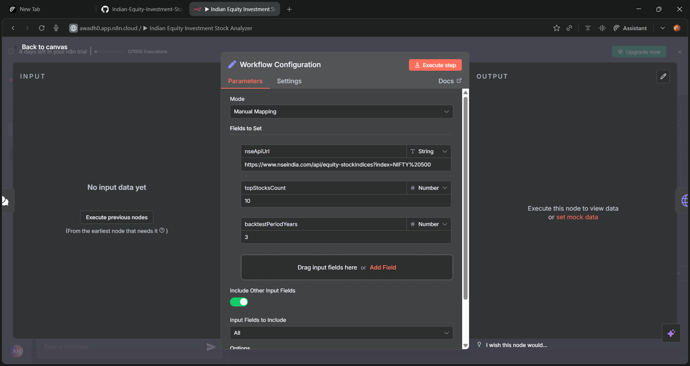
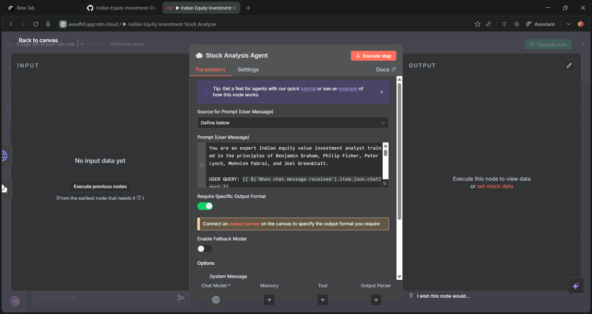
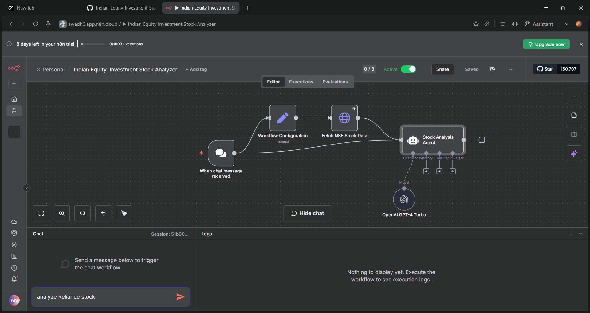
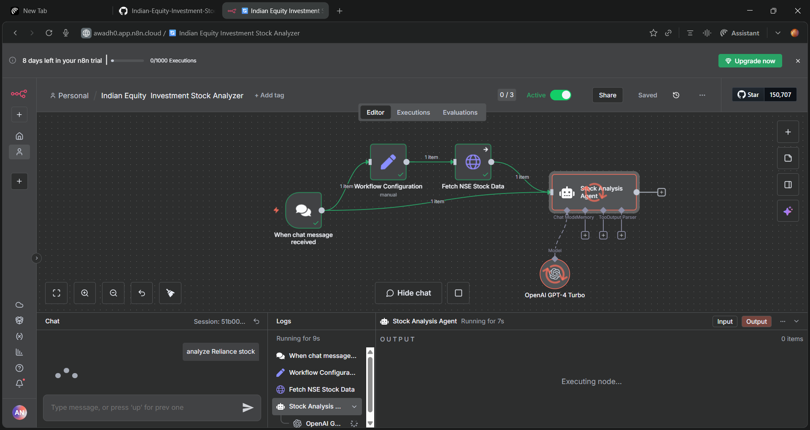

# Indian Equity Investment Stock Analyzer (n8n)

**Indian-Equity-Investment-Stock-Analyzer** is an automated workflow, purpose-built for value investing in the Indian stock market, leveraging the n8n automation platform. This project focuses on robust, data-driven stock analysis—grounded in fundamentals inspired by the "principles of Benjamin Graham, Philip Fisher, Peter Lynch, Mohnish Pabrai, and Joel Greenblatt." investment philosophy—strictly excluding speculation in favor of proven, ethical, and evidence-based decision-making.

## Project Overview

This workflow fetches live stock data from NSE, processes multiple key value indicators, and uses an OpenAI GPT-4 Turbo agent to deliver insightful, readable investment analysis. Every step is recorded and displayed with transparent logs, execution metrics, and clear AI output—making sophisticated analysis accessible to both technical and non-technical users.

### Complete Workflow Architecture

*Figure 1: Complete n8n workflow showing all nodes and their connections for Indian stock analysis*

- **Trigger & Automate:** Start the workflow with a simple chat command (e.g., "Analyze RELIANCE stock").
- **Data Collection:** Instantly pulls latest data from NSE.
- **Fundamental Logic:** Applies value investing models (not speculation) inspired by "Deep Root."
- **AI-Powered:** OpenAI agent (GPT-4 Turbo) interprets data and provides plain-English summary, transparent logs, and run metrics.

## Key Features

- **Automation:** End-to-end analysis powered by n8n workflow nodes for data, logic, and summaries.
- **Live Market Data:** Always operates on up-to-date NSE information.
- **Ethical Value Investing:** No guesswork, only fundamental indicators.
- **User-friendly Results:** Actionable insights, no jargon, full transparency.
- **Stepwise Clarity:** Visualization of setup, in-progress execution, and results (see screenshots).
- **Learning Showcase:** Transparent workflow logs, execution time, and token usage.

## Learning & Aspiration

This project represents my commitment to ethics, transparent workflow automation, and powerful, readable analytics as I pursue a career in data analysis. By blending automation, value principles, and AI, I'm focused on helping users—and future employers—access reliable, actionable market insights for confident investing.

**Tags:** n8n automation, Indian stock market, value investing, data analytics, OpenAI, NSE API, ethical investing, workflow automation

---

## How to use in n8n

1. Import the workflow JSON into your n8n instance
2. Configure your NSE API credentials
3. Set up OpenAI API key for GPT-4 Turbo
4. Activate the workflow and send a chat message with a stock symbol

---

## Workflow Components

### 1. Trigger Node - Chat Message Received

![Trigger Node]

*Figure 2: Chat trigger configuration for receiving user stock analysis requests*

The workflow begins when a user sends a chat message with a stock symbol (e.g., "RELIANCE" or "TCS").

### 2. Workflow Configuration

*Figure 3: Workflow settings and configuration panel*

Configure execution settings, error handling, and workflow parameters here.

### 3. NSE API Node - Live Data Fetching

*Figure 4: National Stock Exchange API integration for real-time stock data*

This node fetches current stock prices, fundamentals, and market data directly from NSE.

### 4. Analysis Agent

*Figure 5: Value investing analysis logic implementation*

Core analysis engine applying value investing principles to evaluate stock fundamentals.

### 5. GPT-4 Summarizer

*Figure 6: AI-powered insight generation using OpenAI GPT-4 Turbo*

Transforms raw analytical data into clear, actionable insights with natural language summaries.

### 6. Supporting Infrastructure

*Figure 7: Data transformation and formatting helper nodes*

Additional nodes handle data preprocessing, formatting, and workflow orchestration.

### 7. Workflow Execution

*Figure 8: Live workflow execution showing real-time processing and results*

Watch the workflow in action as it processes stock data and generates insights in real-time.

## Screenshots and Visual Documentation

For detailed visual documentation of each workflow component, see the [screenshots README](screenshots/README.md) which provides:

1. **Complete Workflow Overview** - Full canvas view of all nodes and connections
2. **Trigger Node** - Chat interface setup for user interaction
3. **Workflow Configuration** - Settings, parameters, and execution options
4. **NSE API Node** - Live data fetching configuration
5. **Analysis Agent** - Value investing logic implementation
6. **GPT-4 Summarizer** - AI-powered insight generation
7. **Supporting Nodes** - Data transformation and formatting helpers
8. **Workflow Execution** - Real-time processing and output display

## Node Documentation

See [nodes.md](nodes.md) for a table of nodes used, purpose, key parameters, and notes. Each node references the official n8n docs and relevant APIs.

- n8n Docs: https://docs.n8n.io/
- HTTP Request Node: https://docs.n8n.io/integrations/builtin/core-nodes/n8n-nodes-base.httpRequest/
- Code Node: https://docs.n8n.io/integrations/builtin/core-nodes/n8n-nodes-base.code/
- AI/OpenAI Node: https://docs.n8n.io/integrations/builtin/ai-openai/

## Repository Structure

- IndianStockAnalyzer-workflow.json (stub, do not use in production)
- /screenshots (visual documentation of workflow)
  - /screenshots (actual image files)
  - README.md (detailed description of each screenshot)
- nodes.md (node table and descriptions)
- LICENSE (MIT or empty)
- .gitignore (Python/Node standard patterns)
- CONTRIBUTING.md (how to contribute)
- CHANGELOG.md (initial version notes)

## Disclaimers

- Screenshots document the workflow structure and configuration; actual implementation may vary
- This is an educational, non-financial-advice project. Always do your own research (DYOR).
- Requires proper API credentials and n8n setup for full functionality
